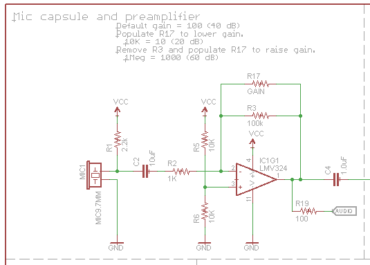
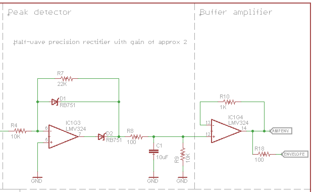
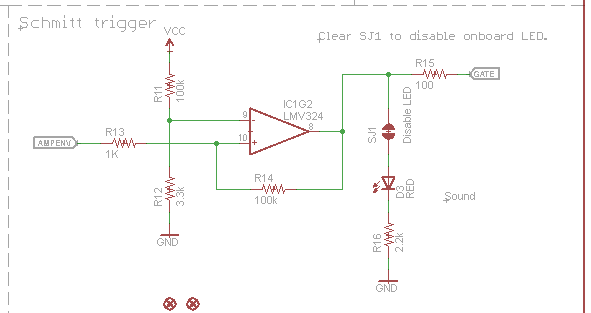

# SparkFun Sound Detector Hookup Guide

	pic - default product img

The Sound Detector is a small board that combines a microphone and some processing circuitry.  It provides not only an audio output, but also a binary indication of the presence of sound and an analog representation of it's amplitude. 

### Quick Start

To get started with the Sound Detector, simply connect it to a power supply, as follows

(Sound Detector → Power Supply )

* GND → Supply Ground
* VCC → Power supply voltage between 3.5 and 5.5 Volts

In a quiet room, power the board up, and then speak into the microphone.  You should see the red LED on the board blink in response to your voice.

With it's 3 outputs, the board itself is a lot more flexible.  To explore that flexibility, read on.

---
## 3 Outputs?

The Sound Detector has 3 separate outputs.  

It's easiest to see what each is doing with a graph.

	waveforms
 
The graph is illustrating voltage over time 

* The dark green trace is the audio output of the sound detector.  The voltage directly from the microphone is found at this output.
* The light green trace is the envelope output.  This analog voltage traces the amplitude of the sound.
* Finally, the red line is the gate output.  This output is low when conditions are quiet, and goes high when sound is detected. 

### How It Works

Having examined the outputs, lets also take a quick walk through the schematic, to gain an understanding of how each stage works. 

#### First Stage

The first section of the circuit is an electret microphone capsule.  The capsule is biased by the supply voltage, and it outputs an AC voltage that is riding a DC offset of approximately 1/2 the supply voltage.  

The `audio` output is riding that bias voltage, so it can be directly connected to the ADC of a microcontroller.

The output from the capsule is an extremely small voltage, so the signal from the capsule is amplified by IC1G1, an operational amplifier stage.  By default, the preamplifier has an arithmetic gain of 100 (20 dB), and the gain can be adjusted by populating R17 (See `link to later`)

#### Second Stage

The second stage of the processing is an envelope follower.  IC1G3 forms an opamp-based precision rectifier.  This stage implements the equation
 
	Vout = if(Vin > 0) 
				then 0,
		   else
				Vin * -2

The opamp inverts and amplifies the signal.  When it's output swings high, D2 turns on, and charges C1.  Thus, C1 tracks the peaks of the input signal.  When the signal is not swinging, D2 is turned off, and C1 discharges through R9. 

IC1G4 is a buffer amplifier, so external loads on the envelope pin won't change the C1's charge/discharge behavior. 

This results in a signal that coarsely follows the peak amplitude of the input signal.  A louder sound will result in a higher voltage on the Envelope pin.

#### Third Stage

The Schmitt trigger watches the envelope signal, and toggles the output when the threshold is exceeded.  The Schmitt trigger is a comparator that adjusts it's threshold voltage when the output switches.  It's requires a higher voltage to switch on than to switch off.  This allows it to ignore some ripple in the input signal, like the ripple present in the output of the envelope follower stage.

---
### Configuration

#### Amplitude Calibration

The Sound Detector comes calibrated for moderate sensitivity - speaking directly into the microphone, or clapping your hands nearby should cause the gate output to fire.  If you find that it doesn't work well in a specific application, you can change the circuit to be more or less sensitive.

It's most likely that you'll find the detector to be too sensitive.  In testing the board for this writeup, noisy air conditioning and music in the next office over were enough to set it off.  To make the board less sensitive, you can lower the preamplifier gain by populating R17.

With R3 in place
R17 val / arith gain / dB Gain
none / 100 / 40 dB
...

If you want to make the sound detector more sensitive, so that it will be activated by quieter sounds, you can remove R3, and populate R17 

With R3 removed
R17 val / arith gain / dB Gain
none / 100 / 40 dB
...

---
#### Lights Out

In some applications, the onboard LED may be distracting or undesirable.  To disable it, simply use a solder sucker or wick to remove the solder blob on SJ1.

	pic of SJ1

---
#### Power Supply Sensitivity

...

---
## Example Code

(Sound Detector → Arduino )

* GND → Supply Ground
* VCC → Power supply voltage between 3.5 and 5.5 Volts
* Gate → Pin 2
* Envelope → A0

Additionally, as described in the [calibration guide](...) , a 33K Ohm resistor was soldered into position R17.  R3 was left in place.
	

This code simultaneously demonstrates two different operating modes of the Sound Detector.  

* First, using the pin change interrupt facility, 
* Second, is uses an analog input to periodically sample the envelop signal.  It uses a series of thresholds to display the relative loudness level on the serial port. 

Hmmm...catch pin change - set LED.
Also sample env in loop, and print occasional messages of loudness?  Quiet, moderate, loud...

This sketch
...uses the pin change interrupt library

When the gate pin goes high ...

...also, outside of the interrupt, ...

---
## Analog Variant

---

## Troubleshooting:
-noisy supply!!
-better at 5V...
-sensitive to handling noise & vibration
	- "dead cat" for wind noise
	- 
## Documentation
* Demo Code 
* SPICE files